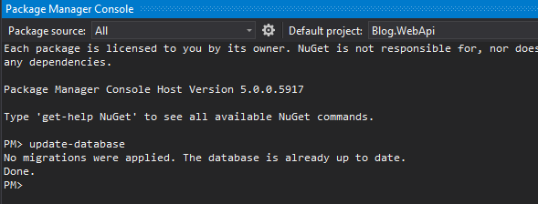
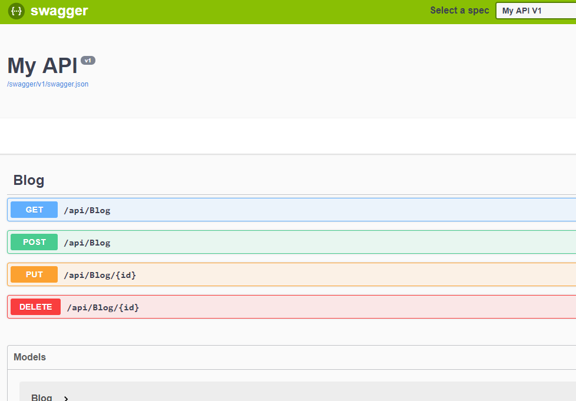

# Model Application Persistence using EF Core

## Module 2

### Open the Blog.Api project

This base asp.net core project will be for us to create and model blog
and blogpost objects in a SQL Server database. You should be able to open
the sln file in visual studio and run the project. Swagger has been included
in the api. If you are interested, swashbuckle startup can be found [here][swashbuckle].

### Get started with EF Core

Before we begin, we will need to configure our project to work with a local database.
This step is to get setup with EF Core. This builds on what we worked with in Module 1.

1. Install the EF Core packages

```
Microsoft.EntityFrameworkCore
Microsoft.EntityFrameworkCore.Proxies
Microsoft.EntityFrameworkCore.SqlServer
```

2. Create a class `BlogContext.cs` that extends DbContext
1. Create a `Blog.cs` class with the following properties
    1. `int BlogId`
    1. `string Url`
    1. `int Rating`
    1. `List<BlogPost> Posts`
1. Create a `BlogPost.cs` class with the following properties
    1. `int BlogPostId`
    1. `string Title`
    1. `string Content`
    1. `int BlogId`
    1. `Blog Blog`
1. Setup `Blogcontext.cs`
    1. Add a `DbSet<T>` property for Blog objects.
    1. You can ignore overriding the OnConfiguration method for now. We are going
    to configure our database using dependency injection instead.

### Create the database

Previously we created the database usign a call on the database context at runtime.
In this module we are going to create the database in visual studio at
design time instead.

In the visual studio Package Manager Console run `Update-Database`.
This command will walk through the DbSet<T> properties in your class
that extends DbContext and create the SQL schema needed to hold your
entities.


### Configure the connection string to come from asp.net core configuration

**Reference:** [connection-strings][docs connection-strings]

Instead of hardcoding the configuration with the context, we would
prefer to pull it from the application settings. Modify your `appsettings.json`
file to include a configuration wtih the connection string.

<details>
<summary>appsettings.json</summary>

```json
{
  "Logging": {
    "LogLevel": {
      "Default": "Warning"
    }
  },
  "AllowedHosts": "*",
  "ConnectionStrings": {
    "BloggingDatabase": "Server=(localdb)\\mssqllocaldb;Database=Blogging;Integrated Security=True;"
  }
}

```

</details>

In the `BlogContext.cs`, remove the configuration override. Instead add a constructor that
takes a `DbContextOptions` object and passes it to the base constructor.

<details>
<summary>BlogContext.cs</summary>

```cs
using Microsoft.EntityFrameworkCore;

namespace Blog.WebApi
{
    public class BlogContext : DbContext
    {
        public DbSet<Blog> Blogs { get; set; }

        public BlogContext(DbContextOptions options) : base(options)
        { }
    }
}
```

</details>

### Configure dependency injection for the controller

In the `Startup.cs` method we will need to register our BlogContext so it can be injected
into our controllers. Add a call to `AddDbContext` on our services object.

<details>
<summary>Startup.cs</summary>

```cs
using Microsoft.AspNetCore.Builder;
using Microsoft.AspNetCore.Hosting;
using Microsoft.AspNetCore.Mvc;
using Microsoft.EntityFrameworkCore;
using Microsoft.Extensions.Configuration;
using Microsoft.Extensions.DependencyInjection;
using Swashbuckle.AspNetCore.Swagger;
using System;
using System.IO;
using System.Reflection;

namespace Blog.WebApi
{
    public class Startup
    {
        public Startup(IConfiguration configuration)
        {
            Configuration = configuration;
        }

        public IConfiguration Configuration { get; }

        // This method gets called by the runtime. Use this method to add services to the container.
        public void ConfigureServices(IServiceCollection services)
        {
            services.AddMvc().SetCompatibilityVersion(CompatibilityVersion.Version_2_2);
            services.AddSwaggerGen(c =>
            {
                c.SwaggerDoc("v1", new Info { Title = "My API", Version = "v1" });
                var xmlFile = $"{Assembly.GetExecutingAssembly().GetName().Name}.xml";
                var xmlPath = Path.Combine(AppContext.BaseDirectory, xmlFile);
                c.IncludeXmlComments(xmlPath);
            });

            services.AddDbContext<BlogContext>(options =>
                options.UseSqlServer(Configuration.GetConnectionString("BloggingDatabase")));
        }

        // This method gets called by the runtime. Use this method to configure the HTTP request pipeline.
        public void Configure(IApplicationBuilder app, IHostingEnvironment env)
        {
            if (env.IsDevelopment())
            {
                app.UseDeveloperExceptionPage();
            }
            else
            {
                // The default HSTS value is 30 days. You may want to change this for production scenarios, see https://aka.ms/aspnetcore-hsts.
                app.UseHsts();
            }

            app.UseSwagger();
            app.UseSwaggerUI(c =>
            {
                c.SwaggerEndpoint("/swagger/v1/swagger.json", "My API V1");
                c.RoutePrefix = string.Empty;
            });
            app.UseMvc();
        }
    }
}
```

</details>

Then we need to pass that object into a new constructor on the `BlogController.cs`

<details>
<summary>BlogController.cs</summary>

```cs
using Microsoft.AspNetCore.Mvc;
using System;
using System.Collections.Generic;
using System.Linq;

namespace Blog.WebApi.Controllers
{
    [Route("api/[controller]")]
    public class BlogController : ControllerBase
    {
        private BlogContext db;

        public BlogController(BlogContext db)
        {
            this.db = db;
        }
    }
}

```
</details>

### Add Migration

To create the database from visual studio, we want to run the update-database
method from the package management console. Running it now will do us no
good however because we do not have any migrations to run. Create a migration
with

```
Add-Migration
```

Then create the database schema with

```
Update-Database
```

We will cover migrations more in depth in another course. For now, notice that
a `Migrations` folder was created in the project, and the code to create or remove
the migration from the schema was created.

### Implement Controller to CRUD Blog posts and blogs

The controller for Blogs has been stubbed out for you.
Uncomment the section in the `BlogController.cs` for each of the http methods.
Run the solution.
You should be presented with a swagger page that shows the different methods
on the Blog controller.



With our database being passed into the constructor we are now (finally) ready to begin implementing
methods that interact with the database.

Implement each of the following methods.

|HTTP Method|Desired Action|
|---|---|
|GET|Return the full list of Blog entities in the database|
|POST|Create a new blog entry with the specified fields|
|PUT|Update the blog entry with the given id with the|
|DELETE|Remove the blog with id from the database|

### Review

In this module we configured EF Core to use a connection string from
`appsettings.json`.
The DbContext class is now registered with the ioc container
and being passed into the BlogController constructor.
An initial migration was added to create the database schema
for our web api.
A CRUD endpoint was implemented to read and write data through
our api.

[swashbuckle]: https://docs.microsoft.com/en-us/aspnet/core/tutorials/getting-started-with-swashbuckle?view=aspnetcore-2.2&tabs=visual-studio
[docs connection-strings]: https://docs.microsoft.com/en-us/ef/core/miscellaneous/connection-strings
